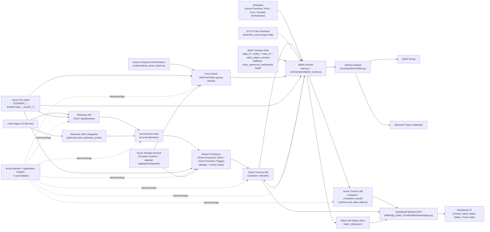

# AI Evals Architecture Diagram (Azure + OpenTelemetry)

This diagram includes Azure services, OpenTelemetry integration paths, and implementation building blocks used by this repository.

## Azure Services in This Diagram

- Azure Event Hubs
- Azure Cosmos DB (SQL API)
- Azure Functions (Timer Trigger and/or Event Hub Trigger option)
- Azure Batch
- Azure Key Vault
- Azure Monitor + Application Insights + Log Analytics
- Azure Storage Account

## Implementation Building Blocks in This Repository

- `FuncApp_Evals_BackEnd/telemetry/api.py`
- `FuncApp_Evals_BackEnd/telemetry/emitter.py`
- `FuncApp_Evals_BackEnd/telemetry/processor.py`
- `FuncApp_Evals_BackEnd/main.py`
- `FuncApp_Evals_BackEnd/orchestration/batch_runner.py`
- `FuncApp_Evals_BackEnd/orchestration/notifier.py`
- `FuncApp_Evals_BackEnd/scripts/submit_azure_batch.py`
- `WebApp_Evals_FrontEnd/dashboard/app.py`
- `WebApp_Evals_FrontEnd/dashboard/static/*`
