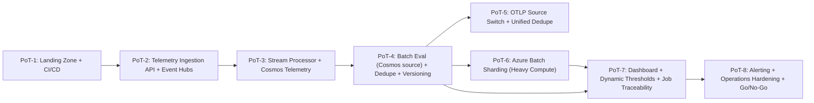

# Azure PoT Roadmap for AI Evaluation Framework

## Purpose

This document defines a **Proof of Technology (PoT)** rollout plan to implement and validate the AI Evaluation framework on Azure in short increments.

- PoT duration: **1 to 2 weeks** each
- Planning horizon: **~12 weeks** (8 PoTs)
- Goal: de-risk architecture early, then scale and operationalize

## Scope and Assumptions

- Existing codebase under:
  - `service/functions/Evals/FuncApp_Evals_BackEnd`
  - `service/functions/Evals/WebApp_Evals_FrontEnd`
- Cosmos DB SQL API is the source of truth for telemetry and evaluation results.
- Duplicate prevention contract:
  - `app_id + policy_name + trace_id + value_object_version`
  - deterministic fallback when trace ID is unavailable.
- Monitoring taxonomy for continuous monitoring metrics is already defined in the project.

## Dependency Map (Critical Path)

## PoT Plan (1–2 Weeks Each)

## PoT-1 (Week 1): Azure Landing Zone and Repo Automation

### Objective
Establish baseline Azure environment, identity, secrets, and deployment automation.

### Dependencies
None.

### Steps
1. Create resource groups by environment (`dev`, optional `test`).
2. Provision Key Vault, Storage Account, App Insights/Log Analytics.
3. Configure managed identities and RBAC for Function App and Batch.
4. Set up GitHub Actions workflows for backend/frontend deploy.
5. Deploy a minimal backend health endpoint.

### Exit Criteria
- CI/CD deploys to Azure successfully.
- Secrets are loaded from Key Vault references.
- Basic telemetry from app is visible in Application Insights.

---

## PoT-2 (Week 2): Telemetry Ingestion API and Event Hubs Publisher

### Objective
Validate ingestion entry points and event publishing patterns.

### Dependencies
PoT-1.

### Steps
1. Deploy telemetry API (`POST /api/telemetry`).
2. Implement/validate library emission path (`telemetry/emitter.py`) to Event Hubs.
3. Define telemetry contract (required fields + trace_id strategy).
4. Add schema validation and dead-letter/error handling strategy.
5. Run load smoke test (burst + sustained).

### Exit Criteria
- Events land in Event Hubs from API and library paths.
- Invalid events are rejected and logged with reason.
- Trace IDs are consistently present or fallback metadata is produced.

---

## PoT-3 (Weeks 3–4): Stream Processor and Cosmos Telemetry Persistence

### Objective
Validate near-real-time processing and storage quality.

### Dependencies
PoT-2.

### Steps
1. Deploy Event Processor Client/Azure Functions trigger consumer.
2. Implement event validation, enrichment, and normalization.
3. Write telemetry documents to Cosmos telemetry container.
4. Tune partitioning, RU throughput, retry/backoff for throttling.
5. Add dashboards/queries for ingestion lag, failures, RU consumption.

### Exit Criteria
- Telemetry documents are written with correct schema and partition key.
- Processor recovers from transient failures without data loss.
- Ingestion throughput target is met for agreed test volume.

---

## PoT-4 (Weeks 5–6): Batch Evaluation from Cosmos + Dedupe + Value Versioning

### Objective
Prove end-to-end continuous monitoring evaluation from Cosmos source.

### Dependencies
PoT-3.

### Steps
1. Configure batch scheduler (timer/cron) and app-level overrides.
2. Run batch evaluation from Cosmos telemetry windows.
3. Persist **metrics-only** evaluation results with value-versioned objects.
4. Validate dedupe gate:
   - deterministic ID: `app_id + policy_name + trace_id + value_object_version`
   - fallback for missing trace IDs.
5. Validate re-evaluation behavior on policy version changes only.

### Exit Criteria
- Scheduled jobs execute for multiple apps with root/default fallback.
- Duplicate evaluations are skipped deterministically.
- Value object metadata supports traceability and replay/rollback.

---

## PoT-5 (Week 7): OTLP Source Mode and Source Switch Validation

### Objective
Prove the configurable telemetry source switch (`cosmos` vs `otlp`) without behavior drift.

### Dependencies
PoT-4.

### Steps
1. Enable OTLP-mode batch source (`telemetry_source.type=otlp`).
2. Parse OTLP traces into internal telemetry model.
3. Validate identical policy execution semantics for both sources.
4. Verify unified dedupe logic across both modes.
5. Compare result quality and cost/latency profile per source mode.

### Exit Criteria
- Source switch works by config only (no code change per deployment).
- Dedupe/versioning behavior matches between OTLP and Cosmos modes.

---

## PoT-6 (Weeks 8–9): Heavy Compute Scaling with Azure Batch Sharding

### Objective
Validate large-scale batch execution using shard-based parallelism.

### Dependencies
PoT-4 (PoT-5 optional but recommended).

### Steps
1. Deploy Azure Batch pool (VM size selection + autoscale).
2. Use shard submission script to create task per `(group_index, group_size)`.
3. Implement queueing/priority strategy for large app populations.
4. Capture per-task logs and status (success/failure/retry reason).
5. Tune retry policy, timeout, and node preemption handling.

### Exit Criteria
- Batch tasks distribute across nodes and complete within SLA.
- Failed shards are traceable and retryable without full rerun.
- Throughput and cost benchmark documented.

---

## PoT-7 (Week 10): Dashboard, Dynamic Thresholds, and Batch Traceability

### Objective
Demonstrate operator visibility and runtime threshold control.

### Dependencies
PoT-4 and PoT-6.

### Steps
1. Expose/validate dashboard APIs (latest metrics, trends, batch status/history).
2. Keep Cosmos results metrics-only; evaluate thresholds at dashboard/runtime.
3. Enable dynamic threshold overrides for analysis scenarios.
4. Add job execution tracing:
   - current status
   - history
   - failed item details + logs
5. Verify OpenAPI/Swagger endpoint publication and docs.

### Exit Criteria
- Dashboard shows status, trend, and failure traceability end-to-end.
- Threshold changes take effect without rerunning batch.
- API contracts are documented and test-verified.

---

## PoT-8 (Weeks 11–12): Alerting, Security, and Production Readiness Gate

### Objective
Validate operational readiness and define go/no-go criteria.

### Dependencies
PoT-7.

### Steps
1. Configure alert channels (Email/Teams) by environment.
2. Add alert routing policy (warning vs critical, app-specific routing).
3. Harden security posture:
   - private networking options
   - secret rotation
   - RBAC least privilege
4. Execute resilience tests (Cosmos throttling, Event Hubs lag, Batch node failure).
5. Run UAT with selected apps and finalize runbooks.

### Exit Criteria
- Alerts are actionable and routed correctly.
- Recovery procedures are documented and tested.
- Go/No-Go review signed with measurable SLO/SLA targets.

## Cross-PoT Test Strategy

For each PoT:
1. Unit tests for changed modules.
2. Integration tests against Azure test resources.
3. One replay test validating dedupe/versioning semantics.
4. Observability checks (logs, metrics, traces) with pass/fail thresholds.

## Key Risks and Mitigations

- Missing/unstable trace IDs:
  - enforce telemetry contract and fallback identity hashing.
- Cosmos RU throttling:
  - autoscale, retry with jitter, query/index tuning.
- Batch cost spikes:
  - shard sizing guardrails, autoscale caps, job prioritization.
- Policy/version drift:
  - explicit versioning in config, change-control workflow, replay tests.
- Operational blind spots:
  - mandatory dashboards for ingestion lag, eval latency, dedupe rate, failure rate.

## Recommended Team Cadence

- Weekly PoT kickoff with scope lock (no mid-week scope expansion).
- Mid-week checkpoint against exit criteria.
- End-of-PoT demo + evidence pack:
  - test report
  - architecture/config changes
  - cost and performance summary
  - risks and decisions log

## Deliverables by End of Roadmap

- Working Azure implementation for telemetry ingestion, processing, and batch evaluations.
- Source-switchable evaluation pipeline (`cosmos`/`otlp`) with consistent dedupe/versioning.
- Scalable shard-based Azure Batch execution model.
- Operational dashboard with dynamic thresholds and failure traceability.
- Runbooks and readiness checklist for production rollout.
