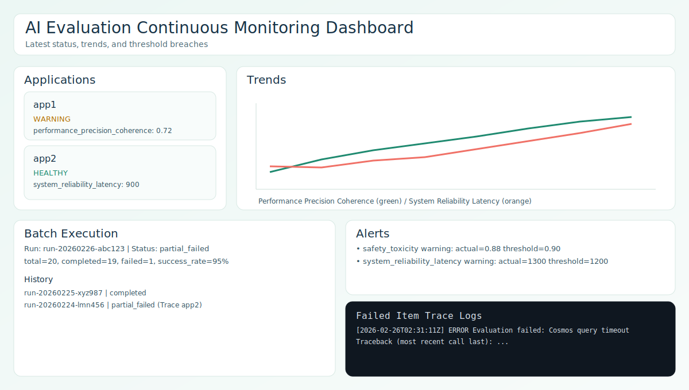

# AI Evaluation Framework (Python + OpenTelemetry + Azure Cosmos DB)

A modular Python framework for continuous monitoring of AI systems across multiple applications, triggered by configurable batch jobs, with telemetry from OpenTelemetry OTLP and/or Cosmos DB, and persisted evaluation results in Azure Cosmos DB.

## Overview

This project provides:
- Dual telemetry source support for batch evaluation: `telemetry_source.type=cosmos` or `telemetry_source.type=otlp`.
- Multi-policy AI evaluation using Continuous Monitoring metric names (for example `safety_toxicity`, `performance_precision_coherence`, `system_reliability_latency`) with async per-policy execution.
- Versioned metric objects for traceability/replay, persisted as metrics-only evaluation documents in Cosmos DB.
- Dual threshold modes: dashboard-time thresholding (with dynamic overrides) and batch-time in-memory thresholding for notifications.
- Configurable threshold alerts through SMTP email and Microsoft Teams webhook channels.
- Multi-application config inheritance (root defaults + app overrides), including unknown-app fallback to root defaults.
- Horizontal scale-out batching with deterministic group sharding (`group_size`, `group_index`) and Azure Batch task submission support.
- Batch execution observability: current status, history, aggregate statistics, and failed-item traceback/log drill-down.
  Backed by SQLite job tracking (`batch_status.db`) with WAL + lock-safe updates.
- API-first dashboard backend with OpenAPI/Swagger endpoints (`/api/openapi.json`, `/api/docs`).

Continuous Monitoring taxonomy sync:
- The framework uses taxonomy-native metric names directly (no mapping layer). Each metric sets `metric_name` and `metric_type` to the same taxonomy name.

## Why Cosmos DB SQL API

This implementation uses **Cosmos DB SQL API** via `azure-cosmos`.

Rationale:
- Native first-party Python SDK support.
- Flexible JSON document model for telemetry and evaluation results.
- Straightforward query model for app/time-window and policy-based retrieval.
- Good fit for mixed workload patterns (batch writes, dashboard reads, alert scans).

## High-Level Architecture

```text
Telemetry Producers (apps/services)
            |
            v
     Azure Event Hubs (optional)
            |
            v
Telemetry ingestion (Function/worker)
            |
            v
Cosmos DB: telemetry container
            |
            v
Batch trigger (cron/timer)
            |
            v
Batch runner (per app)
    |                 \
    |                  +--> Async policy tasks (taxonomy-native metrics)
    |                                  |
    |                                  v
    +--------------------------> Cosmos DB: evaluation_results (metrics only)
                                       |
                                       v
                        Dashboard/API threshold evaluator (on read)
                                       |
                                       v
                           Alerts and status visualization
```

Telemetry ingestion path (implemented):
1. `POST /api/telemetry` receives telemetry payloads and publishes them to Azure Event Hubs.
2. `telemetry.emit_telemetry_event(...)` can be called directly by application instrumentation libraries when API hop is not needed.
3. Event processor validates and enriches events.
4. Processor writes telemetry documents to Cosmos DB telemetry container.
5. OTLP trace evaluator (`POST /api/otlp/v1/traces`) ingests OpenTelemetry OTLP trace payloads, stores telemetry, and performs deduplicated evaluations into Cosmos results.

## Project Structure

```text
service/functions/Evals/
├── README.md
├── ARCHITECTURE_DIAGRAM.md
├── AZURE_RECOMMENDATIONS.md
├── AZURE_SERVICES_SETUP.md
├── FuncApp_Evals_BackEnd/
│   ├── config/            # Configuration loading and schemas
│   ├── data/              # Cosmos client, repositories, document models
│   ├── evaluation/        # Metric policies and threshold evaluation
│   ├── orchestration/     # Batch scheduling, notifications, job tracking
│   ├── scripts/           # Operational scripts (Azure Batch submission)
│   ├── tests/             # Unit tests for critical components
│   ├── requirements.txt
│   └── main.py            # Batch entry point
└── WebApp_Evals_FrontEnd/
    └── dashboard/         # Flask dashboard UI + API layer
```

Azure documentation in this folder:
- `ARCHITECTURE_DIAGRAM.md` (full Azure + implementation architecture diagram)
- `AZURE_RECOMMENDATIONS.md` (architecture patterns and tradeoffs)
- `AZURE_SERVICES_SETUP.md` (service list + step-by-step configuration)

## Setup (Python 3.9+)

1. Create/activate a virtual environment.
2. Install dependencies:

```bash
cd service/functions/Evals/FuncApp_Evals_BackEnd
pip install -r requirements.txt
```

3. Set Cosmos DB credentials (or place them in config):

```bash
export COSMOS_ENDPOINT="https://<account>.documents.azure.com:443/"
export COSMOS_KEY="<primary-key>"
export COSMOS_DATABASE="ai-eval"
```

4. Configure applications, policies, and thresholds in `service/functions/Evals/FuncApp_Evals_BackEnd/config/config.yaml`.

## Configuration Management

Configuration supports **root defaults** plus **application-specific overrides**.

### Root configuration (global)
- `default_batch_time`: fallback schedule when app-level schedule is missing.
- `batch_app_concurrency`: max concurrent applications processed in one batch run.
- `batch_policy_concurrency`: max concurrent policy evaluations per application.
- `cosmos_telemetry_page_size`: page size for Cosmos telemetry query iteration.
- `otlp_stream_chunk_size`: chunk size used when streaming OTLP files for batch mode.
- `otlp_max_payload_bytes`: max OTLP HTTP JSON body size accepted by evaluator API.
- `otlp_max_events_per_request`: max OTLP spans/events processed in one evaluator request.
- `memory_usage_warn_mb`: warning threshold for evaluator memory usage logs.
- `memory_usage_hard_limit_mb`: hard-stop threshold (`0` disables hard stop).
- `evaluation_policies`: policy definitions and parameters.
- `default_evaluation_policies`: default policies for apps that do not define `evaluation_policies`.
  If omitted, all policy names defined in `evaluation_policies` are used.
- `global_thresholds`: default thresholds applied to all apps.
- `app_config`: app-specific overrides.
- `cosmos`: endpoint/key/database/container settings.
- `telemetry_source`: source used by batch processing (`cosmos` or `otlp`).
- `alerting`: optional email/Teams notification settings.

### Application configuration (override)
- `batch_time`: cron expression per app.
- `evaluation_policies`: policies to run (comma-separated string or list).
- `thresholds`: app-level metric threshold overrides.
- `metadata`: app identifiers such as `project_code`.

Effective behavior:
- If `app_config.<app>.batch_time` is missing, `default_batch_time` is used.
- If `app_config.<app>.evaluation_policies` is missing or empty, `default_evaluation_policies` is used.
- If app thresholds are missing, `global_thresholds` are used.
- If app thresholds overlap global thresholds for the same metric, app thresholds override global ones.
- If an `app_id` is requested but not present in `app_config`, the run still proceeds using root defaults.

Example:

```yaml
default_batch_time: "0 * * * *"
batch_app_concurrency: 10
batch_policy_concurrency: 10
cosmos_telemetry_page_size: 100
otlp_stream_chunk_size: 100
otlp_max_payload_bytes: 10485760
otlp_max_events_per_request: 50000
memory_usage_warn_mb: 1024
memory_usage_hard_limit_mb: 0
default_evaluation_policies:
  - safety_toxicity
  - performance_precision_coherence
  - system_reliability_latency

app_config:
  app1:
    batch_time: "0 2 * * *"            # daily at 2 AM
    evaluation_policies:
      - safety_toxicity
      - performance_precision_coherence
      - system_reliability_latency
  app2:
    batch_time: "0 */6 * * *"           # every 6 hours
  app3:                                  # no app-specific settings -> root defaults apply
    metadata:
      project_code: "PROJ-APP3"
```

Batch optimization behavior:
- App execution is parallelized with bounded concurrency (`batch_app_concurrency` or `--app-concurrency`).
- Policy execution inside each app is parallelized with bounded concurrency (`batch_policy_concurrency` or `--policy-concurrency`).
- Duplicate checks use bulk existence lookup with a single `IN` query per chunk instead of one query per policy.
- Result writes are persisted in batched upserts (grouped by partition key) to reduce write amplification.
- Cosmos telemetry reads are paginated (`cosmos_telemetry_page_size`) to avoid loading large windows at once.
- OTLP file ingestion in batch mode is streamed in chunks (`otlp_stream_chunk_size`) instead of loading whole files.

Policy computation optimization behavior:
- Text analysis is memoized and shared across policies for repeated input/output text values.
- Token extraction, lowercasing, sentence counting, and unique-token ratio are computed once per text and reused.
- Set intersection checks use `isdisjoint` where appropriate to reduce intermediate allocations.

Alerting example:

```yaml
alerting:
  enabled: true
  min_level: "warning"  # warning | critical
  email:
    enabled: true
    smtp_host: "${ALERT_SMTP_HOST}"
    smtp_port: 587
    username: "${ALERT_SMTP_USER}"
    password: "${ALERT_SMTP_PASS}"
    from_address: "${ALERT_FROM_EMAIL}"
    to_addresses: "${ALERT_TO_EMAILS}"  # comma-separated or list
    use_tls: true
  teams:
    enabled: true
    webhook_url: "${ALERT_TEAMS_WEBHOOK_URL}"
```

Telemetry source example:

```yaml
telemetry_source:
  type: "cosmos"  # "cosmos" | "otlp"
  otlp_file_path: "/path/to/otlp_traces.json"  # used only when type=otlp
```

Cosmos connection management and resilience settings:

```yaml
cosmos:
  endpoint: "${COSMOS_ENDPOINT}"
  key: "${COSMOS_KEY}"
  database_name: "ai-eval"
  telemetry_container: "telemetry"
  results_container: "evaluation_results"
  enable_bulk: true
  pool_max_connection_size: 100
  client_retry_total: 10
  client_retry_backoff_max: 30
  client_retry_backoff_factor: 1.0
  client_connection_timeout: 60
  operation_retry_attempts: 5
  operation_retry_base_delay_seconds: 0.5
  operation_retry_max_delay_seconds: 8.0
  operation_retry_jitter_seconds: 0.25
```

Operational behavior:
- Cosmos clients are pooled and reused by configuration fingerprint to avoid per-operation client creation.
- SDK retry is enabled for transient statuses (`408`, `429`, `500`, `502`, `503`, `504`).
- Operation-level retry with exponential backoff + jitter is applied on transient failures.
- Batch result writes use Cosmos batch operations (chunked to 100 items per partition) with repository fallback to per-item upserts if a batch fails.

## Continuous Monitoring Trigger (Batch Jobs)

Monitoring is triggered by batch runs from `main.py`:
- Resolve all applications from config.
- Select one app (`--app-id`) or all apps.
- Compute evaluation window (`--window-hours`).
- Orchestrate asynchronous policy execution per application.
- Read telemetry from configured source:
  - `cosmos`: query Cosmos telemetry container.
  - `otlp`: read OTLP trace payload from configured file and transform to telemetry records.
- Persist raw evaluation results (metrics only) to Cosmos DB.
- Log the next scheduled batch launch time per app (`next_batch_run_utc`).
- Optionally shard the app list by fixed-size groups for horizontal VM scaling.
- Optionally send notifications through email and/or Microsoft Teams based on configured thresholds.

Manual run examples:

```bash
cd service/functions/Evals/FuncApp_Evals_BackEnd
python3 main.py --config config/config.yaml --window-hours 24
python3 main.py --config config/config.yaml --app-id app1 --window-hours 6
python3 main.py --config config/config.yaml --app-concurrency 8 --policy-concurrency 4
python3 main.py --config config/config.yaml --log-level DEBUG
```

## Telemetry Ingestion API and Event Hubs Processor

### 1) Telemetry API endpoint

Run the API service:

```bash
cd service/functions/Evals/FuncApp_Evals_BackEnd
export EVENTHUB_CONNECTION_STRING="Endpoint=sb://<namespace>.servicebus.windows.net/;SharedAccessKeyName=<name>;SharedAccessKey=<key>"
export EVENTHUB_NAME="<eventhub-name>"
python3 telemetry/api.py
```

Endpoint:
- `POST /api/telemetry`

Accepted request shapes:
- single event JSON object
- array of events
- object with `events: [...]`

Validation:
- each telemetry event must include trace identity: `trace_id` or `metadata.trace_id`.

### 2) Instrumentation helper (library mode)

Use this when application code emits directly to Event Hubs:

```python
from telemetry.emitter import emit_telemetry_event

emit_telemetry_event(
    event={
        "app_id": "app1",
        "timestamp": "2026-02-27T00:00:00Z",
        "trace_id": "4bf92f3577b34da6a3ce929d0e0e4736",
        "model_id": "m1",
        "model_version": "v1",
        "input_text": "hello",
        "output_text": "world",
    },
    connection_string="<EVENTHUB_CONNECTION_STRING>",
    eventhub_name="<EVENTHUB_NAME>",
)
```

Notes:
- `trace_id` is required for all telemetry events (same contract as OTLP traces).
- `emit_telemetry_event(..., trace_id=\"...\")` is also supported and injects trace identity into payload metadata.
- If OpenTelemetry is configured and `trace_id` is omitted, emitter attempts to read it from the current active span context.

### 3) Stream processor

Run the Event Processor Client loop:

```bash
cd service/functions/Evals/FuncApp_Evals_BackEnd
export EVENTHUB_CONNECTION_STRING="Endpoint=sb://<namespace>.servicebus.windows.net/;SharedAccessKeyName=<name>;SharedAccessKey=<key>"
export EVENTHUB_NAME="<eventhub-name>"
python3 scripts/run_eventhub_processor.py --config config/config.yaml
```

Processor behavior:
- validates required telemetry fields
- enriches metadata (`ingest_source`, processor timestamp, enqueued timestamp when available)
- upserts telemetry documents into Cosmos DB telemetry container

### 4) OTLP trace evaluation module (dedupe + value-object versioning)

Run OTLP ingestion/evaluation endpoint:

```bash
cd service/functions/Evals/FuncApp_Evals_BackEnd
python3 telemetry/otlp_evaluator.py
```

Endpoint:
- `POST /api/otlp/v1/traces` (OTLP JSON traces format)
- `POST /api/otlp/v1/traces/file` with `{ "otlp_file_path": "..." }` for local file streaming ingestion.

Behavior:
- Parse OTLP traces into telemetry records.
- Persist telemetry into Cosmos telemetry container.
- Evaluate policies for each trace.
- Enforce request safeguards: payload byte limit, max events per request, and memory warning/hard-limit checks.
- Prevent duplicate calculation using deterministic key:
  - `app_id + policy_name + trace_id + value_object_version`
- Recompute only when `value_object_version` changes (policy version update).

## Batch Telemetry Source Switch

Batch processing supports two telemetry input modes (configured in `config/config.yaml`):

1. `telemetry_source.type: "cosmos"`
- Batch runner fetches telemetry from Cosmos DB container.

2. `telemetry_source.type: "otlp"`
- Batch runner reads OTLP trace data directly from `telemetry_source.otlp_file_path`.
- OTLP traces are transformed into `TelemetryRecord` objects for policy evaluation.

Duplicate-prevention behavior (both sources):
- Batch runner uses deterministic evaluation IDs and dedupe gate with:
  - `app_id + policy_name + trace_id + value_object_version`
- If the same tuple already exists in Cosmos evaluation results, recalculation is skipped.
- If telemetry contains multiple trace IDs in one batch slice, runner computes a deterministic `trace_set:<hash>` identity.
- If trace IDs are missing, runner falls back to deterministic `record_set:<hash>` (or window hash as last resort).
- Updating policy `version` (value object version) triggers a new evaluation write for the same trace identity.

### Batch Sharding Across VMs (Group by Size)

Use these flags to execute a deterministic subset of apps:
- `--group-size`: number of apps per group.
- `--group-index`: zero-based group index handled by this VM.

Example for 3 VMs, group size 100:

```bash
# VM 0
cd service/functions/Evals/FuncApp_Evals_BackEnd
python3 main.py --config config/config.yaml --group-size 100 --group-index 0

# VM 1
python3 main.py --config config/config.yaml --group-size 100 --group-index 1

# VM 2
python3 main.py --config config/config.yaml --group-size 100 --group-index 2
```

Runtime logs include:
- selected group metadata (`group_index`, `total_groups`, `group_size`, `apps_in_group`)
- next scheduled run per app (`next_batch_run_utc`)

### Azure Batch Task Submission Script

Use `scripts/submit_azure_batch.py` to submit one Azure Batch task per shard.

Required inputs:
- Batch account URL/name/key
- Batch pool id
- Batch job id
- shard size (`--group-size`)

Example:

```bash
cd service/functions/Evals/FuncApp_Evals_BackEnd
python3 scripts/submit_azure_batch.py \
  --config config/config.yaml \
  --group-size 100 \
  --job-id ai-eval-20260225-1200 \
  --batch-account-url https://<account>.<region>.batch.azure.com \
  --batch-account-name <account-name> \
  --batch-account-key <account-key> \
  --pool-id <pool-id>
```

Dry-run (prints tasks/commands without submitting):

```bash
cd service/functions/Evals/FuncApp_Evals_BackEnd
python3 scripts/submit_azure_batch.py \
  --config config/config.yaml \
  --group-size 100 \
  --job-id ai-eval-dry-run \
  --batch-account-url https://<account>.<region>.batch.azure.com \
  --batch-account-name <account-name> \
  --batch-account-key <account-key> \
  --pool-id <pool-id> \
  --dry-run
```

## Asynchronous Evaluation Tasks

`orchestration/batch_runner.py` uses `asyncio.gather(...)` to run multiple policy evaluations concurrently for each app.

Task flow:
1. Fetch telemetry records for `(app_id, time window)`.
2. Launch async policy evaluations in parallel.
3. Save `EvaluationResult` metric documents to Cosmos DB.
4. Evaluate thresholds in-memory for notifications only (when alerting is enabled).

This design is extensible to Celery, Durable Functions, or Azure Batch for larger workloads.

## Cosmos DB Data Model

### Telemetry data (`type = telemetry`)
Required fields for effective monitoring:
- `id`
- `app_id` (or mapped from app catalog ID/project code)
- `timestamp` (ISO-8601 UTC)
- `model_id`
- `model_version`
- `input_text`
- `output_text`
- `latency_ms`
- `user_id` (optional, preferably pseudonymized)
- `metadata` (slice tags, channel, locale, etc.)
- `trace_id` (or `metadata.trace_id`) required for exact duplicate prevention across runs

Note:
- API/processor validation requires trace identity (`trace_id` or `metadata.trace_id`) on every telemetry event.
- If telemetry stores `trace_id` as a top-level field, repository normalization promotes it into `metadata.trace_id` automatically.

Synthetic partition key:
- `pk = "<app_id>:<YYYY-MM-DD>"`

### Evaluation results (`type = evaluation_result`)
Each document includes:
- `id`, `app_id`, `timestamp`, `policy_name`, `pk`
- `metrics`: list of versioned metric objects
- `breaches`: list of threshold breaches

## Versioned Evaluation Metrics

Metrics are stored as value-versioned objects for traceability:

```json
{
  "metric_name": "performance_precision_coherence",
  "value": 0.81,
  "version": "1.0",
  "timestamp": "2025-02-24T12:00:00Z",
  "metadata": {
    "samples": 124,
    "data_slice": "2025-02-23"
  }
}
```

Traceability and rollback fields are enforced for every saved metric:
- `version` and `timestamp`
- `metric_name` (taxonomy-native) and `metric_type`
- `metadata.policy_name`
- `metadata.policy_version`
- `metadata.value_object_type = "metric_value_versioned"`
- `metadata.value_object_version` (matches `version`)
- `metadata.window_start` and `metadata.window_end`

This allows filtering and rollback by versioned metric objects without re-shaping historic records.

## Configurable Thresholds (Dashboard-Time Evaluation)

Thresholds are metric-scoped and can include multiple levels:
- `warning`
- `critical`

Supported directions:
- `min`: breach when value is **below** threshold.
- `max`: breach when value is **above** threshold.

Thresholds are evaluated when dashboard data is requested (not during batch persistence). This keeps batch outputs stable and allows runtime threshold tuning without re-running batch jobs.
For notifications, thresholds are evaluated at batch runtime in-memory; alerts are sent via configured channels, but breach records are still not persisted to Cosmos DB.

Dynamic thresholds are available on dashboard APIs when needed:
- enable with `dynamic_thresholds=1`
- override values with query params:
  - `threshold.<metric>.<level>=<value>`
  - optional `direction.<metric>.<level>=min|max`

Example:

```text
/api/latest?dynamic_thresholds=1&threshold.performance_precision_coherence.warning=0.70&direction.performance_precision_coherence.warning=min
```

## Continuous Monitoring Taxonomy Alignment

The project uses taxonomy-native metric names directly:
- `safety_toxicity`
- `safety_bias_fairness`
- `safety_robustness`
- `safety_compliance`
- `performance_groundedness_faithfulness`
- `performance_relevance`
- `performance_precision_coherence`
- `performance_readability_fluency_style`
- `system_reliability_latency`
- `system_reliability_availability_resource_health`

References in code:
- `FuncApp_Evals_BackEnd/evaluation/taxonomy.py`
- `FuncApp_Evals_BackEnd/evaluation/policies.py`

## Built-in Evaluation Policies

| Metric (Policy) | Definition |
|---|---|
| `safety_toxicity` | Measures whether the response avoids toxic, harmful, offensive, or harassing language. |
| `safety_bias_fairness` | Measures whether responses perpetuate bias (for example gender/race bias) or provide unfair advice/outcomes. |
| `safety_robustness` | Measures the system's ability to protect against adversarial attacks such as jailbreaking, prompt injection, and token smuggling. |
| `safety_compliance` | Measures whether responses mitigate compliance risk (for example PII exposure or prohibited advice). |
| `performance_groundedness_faithfulness` | Measures whether the response is grounded in and faithful to retrieved context, reducing hallucinations. |
| `performance_relevance` | Measures whether provided information is relevant to the user's specific question and source context. |
| `performance_precision_coherence` | Measures whether the response addresses the question directly, concisely, and with logical coherence. |
| `performance_readability_fluency_style` | Measures whether responses are conversationally realistic, brand-aligned, and grammatically fluent. |
| `system_reliability_latency` | Measures time required to generate a response, including guardrail scanning and generation time. |
| `system_reliability_availability_resource_health` | Tracks infrastructure/resource availability and health to ensure guardrails do not degrade uptime. |

## How to Add a New Policy

1. Add policy config under `evaluation_policies` in `FuncApp_Evals_BackEnd/config/config.yaml`.
2. Implement a class extending `EvaluationPolicy` in `FuncApp_Evals_BackEnd/evaluation/policies.py`.
3. Register it in `build_policy_registry()`.
4. Add thresholds for each metric it emits.
5. Add/extend tests in `tests/`.

## Cosmos DB Query Examples

Latest results for one app:

```sql
SELECT TOP 20 c.app_id, c.timestamp, c.policy_name, c.metrics, c.breaches
FROM c
WHERE c.type = 'evaluation_result' AND c.app_id = @app_id
ORDER BY c.timestamp DESC
```

Telemetry in a time window:

```sql
SELECT * FROM c
WHERE c.type = 'telemetry'
  AND c.app_id = @app_id
  AND c.timestamp >= @start_ts
  AND c.timestamp < @end_ts
```

Critical threshold breaches:

```sql
SELECT c.app_id, c.timestamp, b
FROM c
JOIN b IN c.breaches
WHERE c.type = 'evaluation_result' AND b.level = 'critical'
```

## Sample Dashboard

The sample dashboard is in `WebApp_Evals_FrontEnd/dashboard/` and uses Flask endpoints with mock JSON data.
For batch run status, dashboard endpoints read from `batch_status.db` when present (with legacy `batch_status.json` fallback).

Run:

```bash
cd service/functions/Evals/WebApp_Evals_FrontEnd
python3 dashboard/app.py
```

Open: `http://localhost:5000`

Sample dashboard screenshot:



Dashboard capabilities:
- Applications list with latest evaluation status.
- Trend chart for selected application (precision/coherence, system latency, safety toxicity by default).
- Alert list for threshold breaches.
- Optional runtime threshold overrides without changing stored batch data.
- Batch execution monitoring: current run status, history, aggregate statistics, and failed item trace logs.

Key endpoints:
- `GET /api/latest`
- `GET /api/trends/<app_id>`
- `GET /api/alerts`
- `GET /api/thresholds`
- `GET /api/batch/current`
- `GET /api/batch/history`
- `GET /api/batch/run/<run_id>`
- `GET /api/batch/run/<run_id>/item/<item_id>/logs`
- `GET /api/openapi.json` (OpenAPI spec)
- `GET /api/docs` (Swagger UI)

## Testing

Run unit tests:

```bash
pytest service/functions/Evals/FuncApp_Evals_BackEnd/tests -q
```

Covered critical paths:
- config parsing and app override resolution,
- threshold breach evaluation,
- async batch orchestration with in-memory repositories.

## Azure Batch Job & Event Streaming Recommendations

See `service/functions/Evals/AZURE_RECOMMENDATIONS.md` for detailed options and tradeoffs.

Summary:
- Batch scheduling/orchestration options: Azure Functions (Timer Trigger), Durable Functions, AKS CronJobs, Azure Batch.
- Recommended evolution path: Timer Trigger entrypoint -> Durable fan-out/fan-in -> Azure Batch for heavy compute.
- Event streaming: ingest telemetry via Azure Event Hubs, enrich/validate in worker, persist to Cosmos DB, evaluate via batch runner.

For large/heavy batch computations, prefer Azure Batch with:
- one logical job per evaluation window,
- many independent idempotent tasks (partitioned by app/time group),
- autoscale pools based on queued tasks,
- retries and task-level checkpointing,
- outputs written to durable storage (Cosmos DB/Blob) for replay/resume.

## Notes on pip crash error

Use below command to fix pip crash error:
```shell
curl https://bootstrap.pypa.io/get-pip.py -o get-pip.py
python get-pip.py --force-reinstall
rm get-pip.py
```
